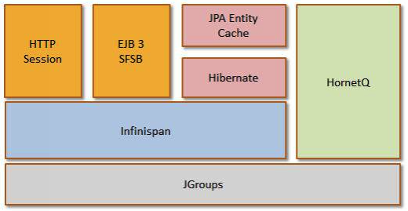

#Clustering



##JGroups

提供集群各成员之间相互通信使用的可靠多播(multicast)系统

###Multicast

is a protocol where data is transmitted simultaneously to a group of hosts that have joined the appropriate multicast group.

###Infinispan

data grid platform

应用服务器用来进行同步应用数据

Session cache 和 JPA/Hibernate 2L cache

##standalone模式下的clustering

* standalone-ha.xml
* standalone-ha-full.xml

如果集群节点绑定到相同的IP上，需要指定node name。

###节点在不同机器上

`standalone.bat –b 192.168.10.1 -c standalone-ha.xml`<br/>
`standalone.bat –b 192.168.10.2 -c standalone-ha.xml`

###节点在同一台机器上

**需要指定节点名字和端口偏移以避免冲突**

`standalone.bat -c standalone-ha.xml -Djboss.node.name=nodeA`<br/>
`standalone.bat -c standalone-ha.xml Djboss.node.name=nodeB -Djboss.socket.binding.port-offset=150`

##Enable clustering services

对于WAR，需要在**web.xml**中声明'distributable'，http session会复制集群各节点中。

```
<web-app>
  <distributable />
</web-app>”
```
##Cluster transport配置

[TODO] JGroups tab in Admin console

##Cluster cache配置

[TODO]

##Passivation of HTTP sessions

jboss-web.xml

```
<jboss-web>
   <max-active-sessions>100</max-active-sessions>
</jboss-web>
```