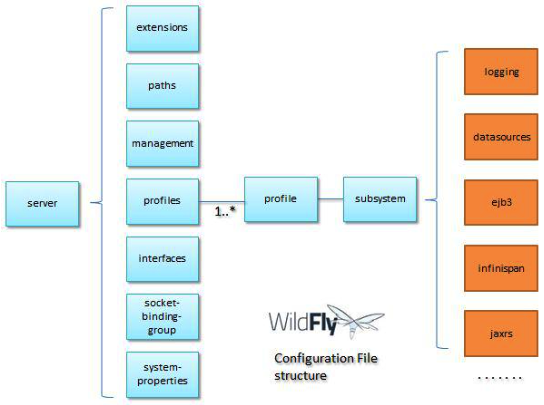
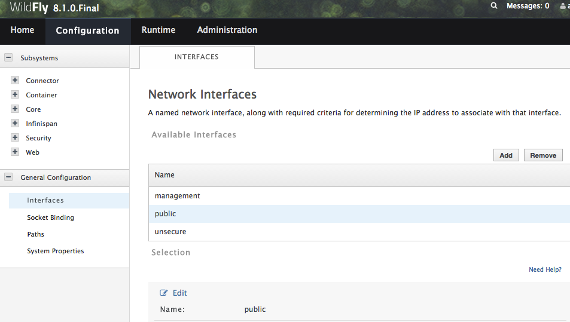

#核心配置

standalone和domain的区别：

* standalone 每个application server instance都是独立的进程 ($JBOSS_HOME/standalone/configuration)
* domain 运行多个application server并且可以集中进行管理。一个domain可以使用多个物理或虚拟机器，每个机器可以运行多个由Host Controller 进程控制的application server instance。 ($JBOSS_HOME/domain/configuration)

##三种管理配置的方式

1. Administration Console
2. Command Line Interface
3. 直接编辑XML配置文件（不推荐）

##配置文件

###配置文件结构



###extensions

服务器大部分功能都是由extension实现，大部分模块都通过extension实现。(org.jboss.as.controller.Extension)

###interfaces

定义服务器绑定的network interface/IP，host name。standalone application server有3个network interface：management，public和unsecure。

```
    <interfaces>
        <interface name="management">
            <inet-address value="${jboss.bind.address.management:127.0.0.1}"/>
        </interface>
        <interface name="public">
            <inet-address value="${jboss.bind.address:127.0.0.1}"/>
        </interface>
        <!-- TODO - only show this if the jacorb subsystem is added  -->
        <interface name="unsecure">
            <!--
              ~  Used for IIOP sockets in the standard configuration.
              ~                  To secure JacORB you need to setup SSL 
              -->
            <inet-address value="${jboss.bind.address.unsecure:127.0.0.1}"/>
        </interface>
    </interfaces>
```

management interface绑定到了jboss.bind.address.management系统属性。可以在启动的时候覆盖这个属性。`standalone.sh -Djboss.bind.address.management=192.168.1.10`

###socket bingding group

socket bingding group定义监听连接的端口，每个socket bingding group对应一个interface。

```
<socket-binding-group name="standard-sockets" default-interface="public" port-offset="${jboss.socket.binding.port-offset:0}">
        <socket-binding name="management-http" interface="management" port="${jboss.management.http.port:9990}"/>
        <socket-binding name="management-https" interface="management" port="${jboss.management.https.port:9993}"/>
        <socket-binding name="ajp" port="${jboss.ajp.port:8009}"/>
        <socket-binding name="http" port="${jboss.http.port:8080}"/>
        <socket-binding name="https" port="${jboss.https.port:8443}"/>
        <socket-binding name="txn-recovery-environment" port="4712"/>
        <socket-binding name="txn-status-manager" port="4713"/>
        <outbound-socket-binding name="mail-smtp">
            <remote-destination host="localhost" port="25"/>
        </outbound-socket-binding>
    </socket-binding-group>
```
###standalone mode的配置

build-in 配置文件

* standalone.xml 默认配置，不包含messaging subsystem，无法加入到cluster中。
* standalone-full.xml 相比默认配置，多了Jacorb libraries和message provider。
* standalone-ha.xml clustering support(JGroups / mod_cluster)
* standalone-full-ha.xml clustering和messaging

在启动是指定配置文件以替换默认配置 `standalone.sh -c standalone-full.xml`

##通过Administration Console管理配置

###Configuration tab

