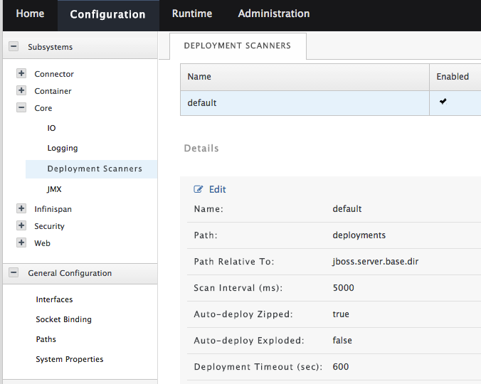

# 部署应用

## 应用部署的四种方式

* 直接copy文件到deployments目录（仅适用于standalone模式）

`cp example.war $JBOSS_HOME/standalone/deployments`

Deployment scanner负责部署copy进去的war文件。Deployment scanner有2种工作模式：

	1. Auto-deploy mode - 直接监视deployments目录下的文件，自动部署、重新部署时间戳发生变化的文件。
	
	2. Manual-deploy mode - Deployment scanner依靠marker文件工作，可以通过添加、删除marker文件告诉Deployment Scanner deploy，redeploy或undeploy文件。
	
	cp -r Example.ear $JBOSS_HOME/standalone/deployments
	touch $JBOSS_HOME/standalone/deployments/Example.ear.dodeploy

Deployment scanner 配置


* Admin Console

[Runtime] -> [Manage Deployments]

* CLI (standalone mode)
	
`deploy $HOME/example.war`<br />
`undeploy example.war`<br />
`deploy $HOME/example.war` (redeploy)<br />
	
```
if (outcome != success) of /deployment=myproject.war:read-resource  
     deploy myproject.war  
end-if
```
* 通过maven部署 (standalone)

在porject的pom.xml中添加wildfly-maven-plugin

```
<project>
    ...
    <build>
        ...
        <plugins>
            ...
            <plugin>
                <groupId>org.wildfly.plugins</groupId>
                <artifactId>wildfly-maven-plugin</artifactId>
                <version>1.0.2.Final</version>
            </plugin>
            ...
        </plugins>
        ...
    </build>
...
</project>
```
部署前确保服务器已经运行<br />
`mvn wildfly:deploy`<br />
`mvn wildfly:undeploy`<br />
`mvn wildfly:redeploy`<br >

##Datasource配置

###Admin console

####创建JDBC module

以MySQL为例:

创建目录**JBOSS_HOME/modules/com/mysql/main**

将driver jar copy到**main**下

在**main**下创建**module.xml**

```
<?xml version="1.0" encoding="UTF-8"?>
<module xmlns="urn:jboss:module:1.0" name="com.mysql">
  <resources>
    <resource-root path="mysql-connector-java-5.1.31.jar"/>
  </resources>
  <dependencies>
    <module name="javax.api"/>
    <module name="javax.transaction.api"/>
  </dependencies>
</module>
```
####在Admin console中添加datasource并测试

###CLI

创建module
`module add --name=com.mysql --resources=$Home/mysql-connector-java-5.1.31-bin.jar --dependencies=javax.api,javax.transaction.api`

安装driver
`/subsystem=datasources/jdbc-driver=mysql:add(driver-name=mysql,driver-module-name=com.mysql)`

查看driver是否安装成功
`/subsystem=datasources:installed-drivers-list`

####添加datasource

`data-source add --jndi-name=java:/MySQLDS --name=MySQLPool --connection-url=jdbc:mysql://localhost:3306/mysqlschema --driver-name=mysql --user-name=name --password=password`

###将datasource作为deployable资源部署

1. `cp mysql-connector-java-5.1.31-bin.jar $JBOSS_HOME/standalone/deployments`
2. 部署datasource配置文件到deployments目录下，文件名如xxx-ds.xml，mysql-ds.xml示例：

```
<datasources xmlns="http://www.jboss.org/ironjacamar/schema">
  <datasource jndi-name="java:jboss/datasources/MySQLDS" pool-name="MySQLPool">
  <connection-url>jdbc:mysql://localhost:3306/mysqlschema</connection-url>
  <driver>mysql-connector-java-5.1.24-bin.jar</driver>
  <pool>
    <max-pool-size>30</max-pool-size>
  </pool>
  <security>
    <user-name>jboss</user-name>
    <password>jboss</password>
  </security>
  </datasource>
</datasources>
```
***这种方式配置的datasource无法通过Admin console和CLI管理***

###将datasource打包进application package中

应用类型 | xxx-ds.xml文件位置
------- | --------------------
War | WEB-INF 
EJB jar | META-INF
EJB ear | 最顶层的META-INF

**mysql-connector-java-5.1.31-bin.jar需要先部署到deployments目录下**<br />
***这种方式配置的datasource无法通过Admin console和CLI管理***

也可以把mysql-connector-java-5.1.31-bin.jar打包进应用中以创建self-consistent applicationchuang。

个人觉得采用Admin console或CLI配置，在应用中用jndi引用datasource比较好，方便监控datasoure。

