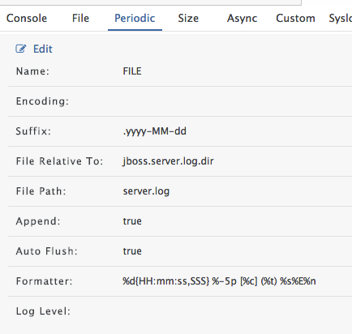
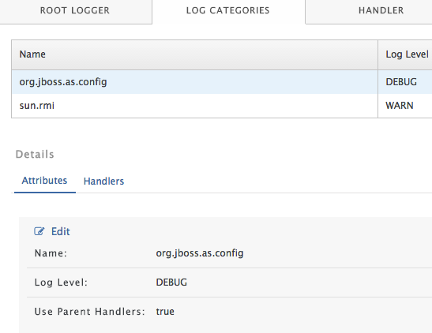

# Logging

基于Java UTIL Logging API (JUL)

jboss.server.log.dir

默认位置$JBOSS_HOME/standalone/log/server.log

`standalone.sh -Djboss.server.log.dir=/home/user/logs`

###Log Handler

Handler接收到log event，将log输出到指定位置。

####6种Handler

* Console
* File
* Periodic 依据时间设置rotating log文件
* Size 依据文件大小设置rotating log文件
* Async 使用异步线程
* Custom 使用其他Class来记录日志（需要扩展java.util.logging.Handler）

####Handler属性设置

#####Formatter

%d{HH:mm:ss,SSS} 时间戳

%-5p log priority

[%c] log category

(%t) 产生log的线程

%s log信息

%M 产生log的method

%n 换行

###Root Logger

默认是INFO级别，Handler有Console和File。在生产环境，WildFly一般是系统服务，日志都输出到文件。

**Changing the Root Logger Level has a severe impact on your applications as it will alter the verbosity of all log messages from packages that have no specific Logger attached to it.**

###Log Category

