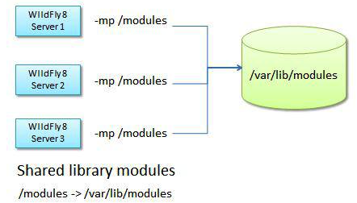

#modules

在WildFly中，Class loading机制基于JBoss Modules，不再是hierarchical，而是模块化的。

不再使用一个Class loader把所有JAR包加载到一个class path中。每一个lib都是一个模块，只链接到它依赖的模块。

##Static Modules

安装在modules目录下的树状目录下。每个模块包含一个或多个JAR文件和一个配置文件-modules.xml。

应用服务器核心lib和Java EE APIs都是静态模块。可以将第三方lib安装为静态模块。

###配置

JBOSS_MODULEPATH环境变量，默认位置为$JBOSS_HOME/modules。

`export JBOSS_MODULESPATH=/usr/libs/custom-modules:$JBOSS_HOME/modules`

启动时可以使用-mp选项覆盖

####多个server实例共享modules


####安装新模块


#####modules.xml
```
<module xmlns="urn:jboss:module:1.1" name="org.jython">
<resources>
  <resource-root path="jython-standalone-2.5.2.jar"/>
</resources>
<dependencies>
  <module name="javax.api"/>
</dependencies>
</module>
```
####在应用中使用模块

#####1. 推荐方式

META-INF/MANIFEST.MF

`Dependencies: org.jython,org.apache.log4j`

`Dependencies: org.jython,org.apache.log4j export` 在EAR中可以暴露给submodules。

#####2. global module

所有deployments都可以访问到

Admin Console -> Container -> EE Subsystem 创建新模块，**Isolated Subdeployment**设置为false。

##Dynamic Modules

在部署lib的时候创建、加载，如EAR，JAR和WAR，deployment archive的名字作为模块名。

###使用

`deployment.[archive name]`<br/>
`deployment.[ear archive name].[sub deployment archive name]`

例子

`Dependencies: deployment.WebExample1.war`<br/>
`deployment.EnterpriseApp.ear.WebExample1.war`

##模块依赖关系

###Implicit dependencies

Java EE core libraries视为隐式依赖，会自动添加到应用中。

###Explicit dependencies

除了隐式依赖，其实模块使用需要显示声明，如果前面的jython例子。

###Classloading Policies

####jboss-deployment-structure.xml

The advantage of using this file (compared to the Manifest’s entry) is that you can define dependencies across top level deployments and subdeployments.

```
<jboss-deployment-structure>
  <deployment>
      <dependencies>
         <module name="deployment.itextpdf-5.4.3.jar" export="TRUE"/>
      </dependencies>
    </deployment>
</jboss-deployment-structure>
```
```
<jboss-deployment-structure> 
   <sub-deployment name="myapp.war">
    <dependencies>
      <module name="deployment.itextpdf-5.4.3.jar" />
    </dependencies>
  </sub-deployment> 
</jboss-deployment-structure>
```
```
<jboss-deployment-structure>
  <deployment>
      <dependencies>
         <module name="org.apache.log4j" export="TRUE"/>
      </dependencies>
    </deployment>
</jboss-deployment-structure>
```
#####How to prevent your modules from being loaded

```
<jboss-deployment-structure>
   <deployment>
      <exclusions>
         <module name="org.dom4j" slot="1.1"/>
      </exclusions>
      <dependencies>
         <module name="org.xom" />
      </dependencies>
   </deployment>
</jboss-deployment-structure>
```

######slot
用来指定版本，不一定是version number，应该是模块的目录名字。

#####How to prevent a subsystem from being loaded

```
<jboss-deployment-structure>
   <deployment>
    <exclude-subsystems>
      <subsystem name="resteasy" />
    </exclude-subsystems>
   </deployment>
</jboss-deployment-structure>
```