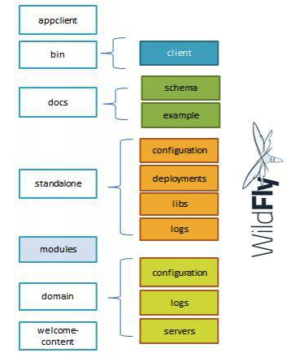

# WildFly 安装

##系统要求

* 8.1.0.Final [下载地址](http://wildfly.org/downloads/)
* JDK 1.7 +

### 安装步骤

1. 设置$JAVA_HOME环境变量
2. 将WildFly压缩包解压到某一目录（/Users/yang/dev/wildfly
3. 设置$JBOSS_HOME环境变量 `export JBOSS_HOME=/Users/yang/dev/wildfly`

##WildFly目录结构

* appclient 配置文件，部署内容
* bin 启动脚本和启动配置文件
* standalone standalone模式下的配置文件，部署内容
* domain domain模式下的配置文件和部署内容
* modules 包含所有安装到application server的模块

##standalone模式启动

* `cd $JBOSS_HOME/bin`
* `./standalone.sh`

打开http://localhost:8080/可以看到欢迎页面

### 启动配置文件

standalone.conf

设置$JBOSS_HOME环境变量并不是必须的，可以在启动配置文件中设置。

## Administration Console

点击欢迎页面的Administration Console链接时，提示需要创建user。可以通过$JBOSS_HOME/bin/add-user.sh脚本创建user。

执行add-user.sh会进入交互模式，可使用以下命令直接创建管理员 `./add-user.sh -m -u wildflyadmin -padmin`。（-m management, -a application）**密码不符合要求，wildflyadmin没有创建成功，建议使用交换模式。**

##standalone模式停止WildFly

* `./jboss_cli.sh`
* `connect` (连接远程服务器 `connect 192.168.1.10:9990`)
* `shutdown`

`./jboss-cli.sh -c --command=shutdown`